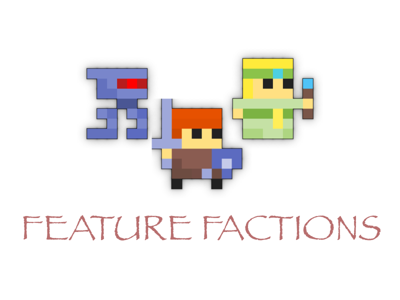

# Feature Factions RPG 🎲

Welcome to Feature Factions, where the fate of three ancient races rests in your hands! Will you join the precise and mechanical Aetheron, the resilient and cunning Bessari, or the mystical and graceful Calenwyn? Mine resources to fuel your faction’s treasury—the Central Node 🤖, Guild Vault 🧑‍🏭, or Sylvan Reliquary 🧝‍♀️. Work with your allies to unlock powerful upgrades and strategize for the ultimate showdown. The war is coming—#StopPretending 🧙and  #StartShipping 🚀

## How to Play

1. Install and Choose Your Race

- Aetheron: Logical and mechanical innovators. 🤖
- Bessari: Tenacious and resourceful humanoids. 🧑‍🏭
- Calenwyn: Mystical and nature-bound elves. 🧝‍♀️

2. Mine Resources

Keep the app running to mine resources automatically. These resources are essential for upgrades and advancing your faction.

3. Contribute to Your Faction’s Treasury
 
- Central Node for Aetheron 🤖
- Guild Vault for Bessari 🧑‍🏭
- Sylvan Reliquary for Calenwyn 🧝‍♀️

These contributions power faction upgrades and unlock key advantages.

4. Collaborate and Strategize

Team up with your faction to decide how to spend resources. Strategically unlock upgrades to outpace rival factions in the race to victory.

5. Recruit Your Friends

Invite friends to join your faction! Every new player boosts your resource mining rate, giving your faction a strategic edge.

6. Prepare for the Final Battle

The war is inevitable. Outsmart and outmaneuver rival factions by collaborating effectively and staying active. The future of your race depends on your actions!

Are you ready to shape your destiny? Join Feature Factions RPG today and claim your place in this epic saga! #FeatureFactions #EpicRPG #FeatureFlags 🎮

----
*This is a submission for the [DevCycle Feature Flag Challenge](https://dev.to/challenges/devcycle): Feature Flag Funhouse*

https://dev.to/bytehala/feature-factions-mobile-cooperate-and-battle-with-devcycle-feature-flags-4mnk
